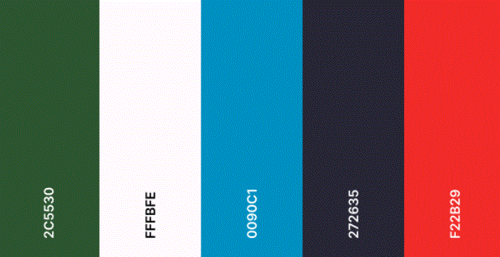
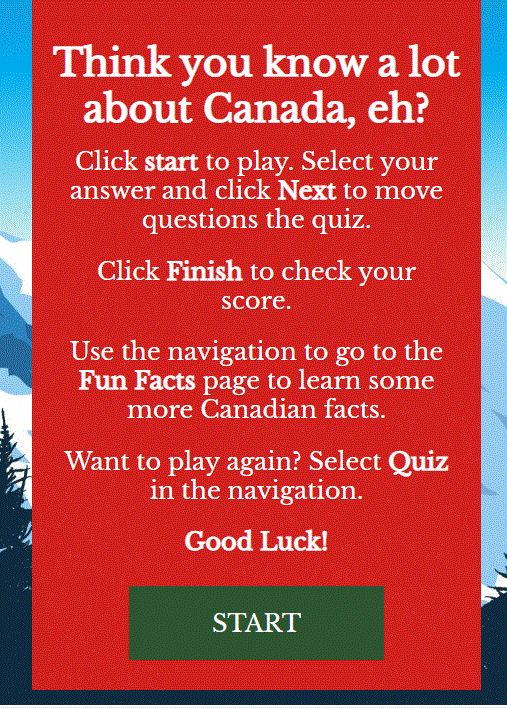
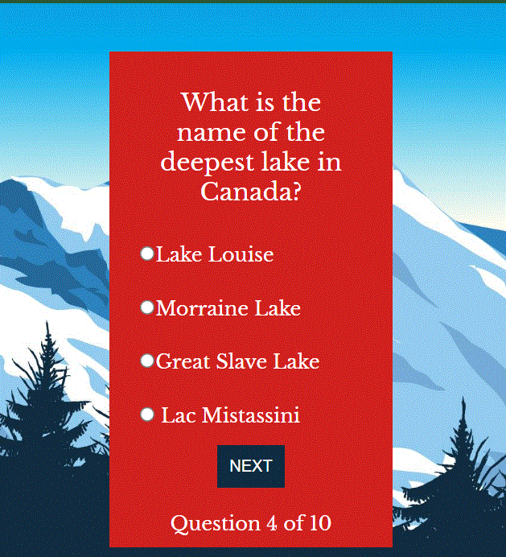
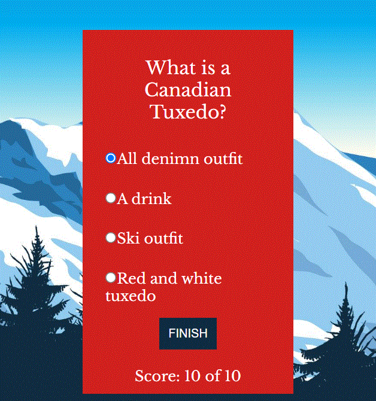

# [O Canada!](https://ciaralynch72.github.io/oh_canada_quiz/)

For my second milestone project I have came up with an idea to create a fun quiz about Canada. Canada is quite often overshadowed by it's neighbor to the south so I wanted to create a quiz that showcases some intereseting facts about Canada. 

### Site owner's goals ###
To create a fun and engaging quiz using html, css and vanilla javascript that will allow a player to answer a series of questions and get their score at the end. 
To do this I plan to implement the following features:
- A score tracking system
- A series of questions and possible answers
- At the end of the quiz the user will be told there score out of a possible 10

### External user goals ###
To be able to play a quiz that will test their knowledge on Canada and to be able to know how well they did and hopefully learn some new facts along the way

## UX ##

### Strategy ### 
This site will be used by those interesed in testing their knowledge on Canada and hopefully learning some new fun and interesting facts as they progress along throught the quiz. 

#### Target Audience ####
- Anyone aged 8 and up that has an general interest in Canada
- People looking to expand their knowledge of Canada
- People who enjoy quizes 

#### Features required ####
- A start quiz button
- Quiz questions and possible answers
- A next/previous and restart quiz button
- Score tally at the end of the quiz

The website needs to be intuitive and easy to navigate for the user. Users need to get a sense of accomplishment when they finish and know how well they have done. The site is responsive to all  screens so the user can enjoy the quiz anywhere. 

### Scope ###
To deliver a site to meet user needs I will need to have to following features in place:
- A home screen with a welcome mesage and a start button
- Quiz questions with options 
- A questions counter to show the progression of the questions
- A score tally to show the user their score

### Structure ###

This will be a simple website where the user will be presented with some welcome information on the quiz. When the user clicks the 'Start quiz' button that will lead them through a series of questions testing their general knowlege of Canada.

The site will be easy to navigate and intuitive to all the user to have a pleasant experience. 

### Skeleton ###

Wireframes
-  [Mobile](docs/readme_images/mobile-wireframe.GIF)
-  [Web Home](docs/readme_images/web_wireframe%20_home.GIF)
-  [Web Home Question](docs/readme_images/web_wireframe_question.GIF)
-  [Web Home Answer](docs/readme_images/web_wireframe_answer.GIF)

The wireframes were created as a base for this project to help me get a concrete visual of what I wanted and needed to build for this project. It will be a reference point thoughout and it will help me visualize what I need to create in my html, css and js documents 

### Surface ###

For this quiz I have chosen colors that are found all across the Canadian landscape and will resonate with anyone who has seen photos of Canada. The blue which can be seen in glacier lakes, the green of the forests and the red of the Canadian Flag. For accessibility purposes I darkened some of the colors so that it would be be complient with Lighthouse. 

I have chosen Open Sans and Libre Bakersville fonts as similar fonts are used for the offical Canada wordmarks so I feel they will resonate with the site user and look familar. 

## Features ##

### Current Features ###

Below is a list of current features for the website. As I am completely new to JavaScript I am finding it enjoyable but slow and difficult to learn so I decided to keep the site very basic so that I could write the code and learn as I go. 

#### Header ####
A basic header with the name of the quiz with an icon from font awesome.

#### Quiz Card ####
The quiz card will hold all the contents of the quiz so the user will focus on this area while completing the quiz.

#### Welcome Message ####
A welcome message will display to the user to introduce them to the quiz.

#### Start Button ####
The start bottom is below the welcome message and when hoovered over it will change color and begin the quiz for the user.

#### Questions ####
A set of 10 questons will be displayed to the user as part of the quiz. When the user chooses one question and clicks the next button a new questions will display.

#### Multi-choice Answers ####
The user will be presented with four multi-choice radio buttons to choose an anwers to the quiz question. 

#### Next Button #### 
The next button will allow the user to iterate through the question and will change to a lighter shade of blue when it is hoovered over.

#### Finish Button ####
The finish button will appear on the final question and it will become blue when it is pressed and show the user their score. 

#### Questions Counter ####
The question counter appears at the bottom of the quiz one the start button is clicked. It will let the user know how many questions are in the quiz and what is their current question. 

#### Score Counter ####
On the last question the next button will transition to a finish button. When the user click on it, it will relay their score back to them.

### Features to include in the future ####
In the future I would like to add a lot more functionality to this site as my skills and knowledge of JavaScript increase. As I tried to work out as much JS as possible by myself, although a great learning, it did leave me shy on time to add features which I orginally wanted as part of my quiz. 

#### User Name ####
I would like to add a feature to store the users name and display high scores. 

#### Images and infomation about each correct answer ####
I look forward to expanding the quiz by adding images and information to inform the user more about the correct answer as I feel this will bring greater user satisfaction. 

#### More questions so that the questons are changed up if the user wishes to play again ####
I would like to eventually to source questions via API and sort them randomly so that the user can reset the quiz and answer different questions and continue to test their knowledge. 

## Credits ##
I have used the following tutorials as inspiration to create this quiz [SitePoint](https://www.sitepoint.com/simple-javascript-quiz/) and Youtube, most notably [CodingNepal](https://www.youtube.com/watch?v=WUBhpSRS_fk&t=5s) and [BrianDesign](https://www.youtube.com/watch?v=f4fB9Xg2JEY)