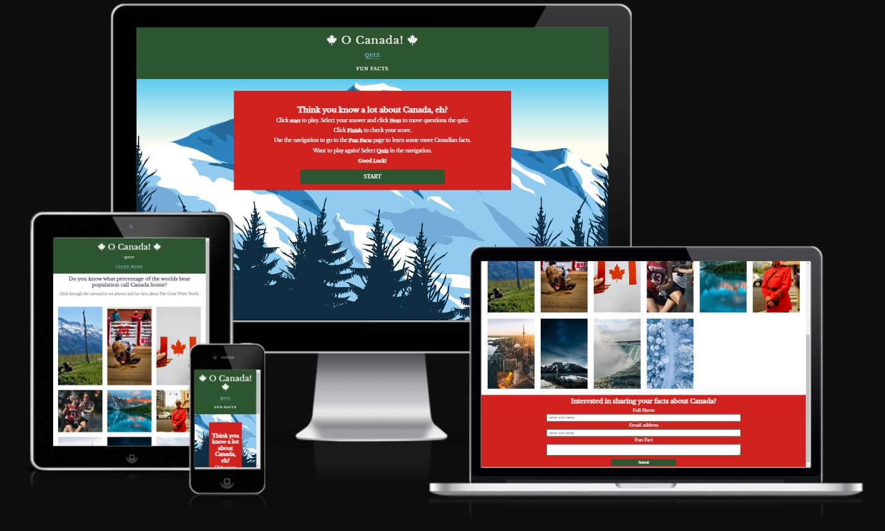
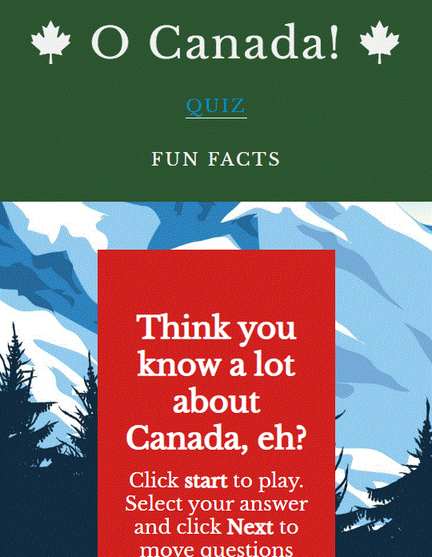

# [O Canada!](https://ciaralynch72.github.io/oh_canada_quiz/)

For my second milestone project I have came up with an idea to create a fun quiz about Canada. Canada is quite often overshadowed by it's neighbor to the south so I wanted to create a quiz that showcases some intereseting facts about Canada. 

* [Site owner's goals](<#site-owner's-goals>)
* [External user goals](<#external-user-goals>)
* [UX](<#ux>)
    * [Strategy](<#strategy>)
    * [Scope](<#scope>)
    * [Structure](<#structure>)
    * [Skeleton](<#skeleton>)
    * [sureface](<#surface>)
* [Features](<#features>)
* [Technologies Used](<#technologies-used>)
* [Testing](<#testing>)
* [Bugs](<#bugs>)
* [Credits](<#credits>)

### Site owner's goals ###
To create a fun and engaging quiz using html, css and vanilla javascript that will allow a player to answer a series of questions and get their score at the end. To add an additonal page where the user can view photos accompanied by facts to learn more.
To do this I plan to implement the following features:
- A score tracking system
- A series of questions and possible answers
- At the end of the quiz the user will be told there score out of a possible 10
- A gallery with a carusel

### External user goals ###
To be able to play a quiz that will test their knowledge on Canada and to be able to know how well they did and hopefully learn some new facts along the way.

## UX ##

### Strategy ### 
This site will be used by those interesed in testing their knowledge on Canada and hopefully learning some new fun and interesting facts as they progress along throught the quiz. 

#### Target Audience ####
- Anyone aged 8 and up that has an general interest in Canada
- People looking to expand their knowledge of Canada
- People who enjoy quizes 

#### Features required ####
- A start quiz button
- Quiz questions and possible answers
- A next/previous and restart quiz button
- Score tally at the end of the quiz
- A gallery page with a carusel

The website needs to be intuitive and easy to navigate for the user. Users need to get a sense of accomplishment when they finish and know how well they have done. The site is responsive to all  screens so the user can enjoy the quiz anywhere. 

### Scope ###
To deliver a site to meet user needs I will need to have to following features in place:
- A home screen with a welcome mesage and a start button
- Quiz questions with options 
- A questions counter to show the progression of the questions
- A score tally to show the user their score
- A page where the user can view photos that are accompanied by facts
- A form where the user can send their own fun fact to the developer

### Structure ###

This will be a simple website where the user will be presented with some welcome information on the quiz. When the user clicks the 'Start quiz' button that will lead them through a series of questions testing their general knowlege of Canada. A navigation will allow the user go between pages to expand their experience

The site will be easy to navigate and intuitive to all the user to have a pleasant experience. 

### Skeleton ###

Wireframes
-  [Mobile](docs/readme_images/mobile-wireframe.GIF)
-  [Web Home](docs/readme_images/web_wireframe%20_home.GIF)
-  [Web Home Question](docs/readme_images/web_wireframe_question.GIF)
-  [Web Home Answer](docs/readme_images/web_wireframe_answer.GIF)

The wireframes were created as a base for this project to help me get a concrete visual of what I wanted and needed to build for this project. It will be a reference point thoughout and it will help me visualize what I need to create in my html, css and js documents 

### Surface ###

For this quiz I have chosen colors that are found all across the Canadian landscape and will resonate with anyone who has seen photos of Canada. The blue which can be seen in glacier lakes, the green of the forests and the red of the Canadian Flag. For accessibility purposes I darkened/lightened some of the colors so that it would be be complient with Lighthouse. 

I have chosen Open Sans and Libre Bakersville fonts as similar fonts are used for the offical Canada wordmarks so I feel they will resonate with the site user and look familar. 

## Features ##

- ### Current Features ###

Below is a list of current features for the website. As I am completely new to JavaScript I am finding it enjoyable but slow and difficult to learn so I decided to keep the site very basic so that I could write the code and learn as I go. 

- #### Header ####
A basic header with the name of the quiz with an icon from font awesome.

- #### Navigation ####
The navigation was added so that I could add a second page with more facts for the user. As I ran out of time to figure out a restart button I improvised and added a link back to the quiz. 

- #### Quiz Card ####
The quiz card will hold all the contents of the quiz so the user will focus on this area while completing the quiz.

- #### Welcome Message ####
A welcome message will display to the user to introduce them to the quiz and to walk them throught the features they will come accross. 

- #### Start Button ####
The start bottom is below the welcome message and when hoovered over it will change color and begin the quiz for the user.

- #### Questions ####
A set of 10 questons will be displayed to the user as part of the quiz. When the user chooses one question and clicks the next button a new questions will display.

- #### Multi-choice Answers ####
The user will be presented with four multi-choice radio buttons to choose an anwers to the quiz question. 

- #### Next Button #### 
The next button will allow the user to iterate through the question and will change to a lighter shade of blue when it is hoovered over.

- #### Finish Button ####
The finish button will appear on the final question and it will become blue when it is pressed and show the user their score. 

- #### Questions Counter ####
The question counter appears at the bottom of the quiz one the start button is clicked. It will let the user know how many questions are in the quiz and what is their current question. 

- #### Score Counter ####
On the last question the next button will transition to a finish button. When the user click on it, it will relay their score back to them.

- #### Fun Facts Page ####
I added a fun facts page which shares more facts with the user along side pictures that relate to each fact.

- #### Fancy Box Carousel ####
A gallery of images with more fun facts for the user to gain more knowledge if they wish

- #### Form to submit facts ####
I added a form to submit facts as a last minute addition. I had issus serperating the script to a serperate file and due to time constraints it was added on the html page.

- ### Features to include in the future ####
In the future I would like to add a lot more functionality to this site as my skills and knowledge of JavaScript increase. As I tried to work out as much JS as possible by myself, although a great learning experience, it did leave me shy on time to add features which I orginally wanted as part of my quiz. 

#### User Name ####
I would like to add a feature to store the users name and display high scores. 

#### Images and infomation about each correct answer ####
I look forward to expanding the quiz by adding images and information to inform the user more about the correct answer as I feel this will bring greater user satisfaction. 

#### More questions so that the questons are changed up if the user wishes to play again ####
I would like to eventually to source questions via API and sort them randomly so that the user can reset the quiz and answer different questions and continue to test their knowledge. 

#### Make the form a modal pop up ####
Add a modal pop as the form. 

#### Add a restart button function ####
Add a feature so the user can return to the start of the quiz if they would like to play again

#### A function to require the user to answer a question before moving on ####
I would like to be able to require the user to choose an answer before iteration through the question

## Technologies Used
I have used several technologies that have enabled this design to work:

- **HTML** used to create the static website
- **CSS** used to style the website
- **JavaScript** use to create the functionality of the game
- [**Google Fonts**](https://fonts.google.com/)
    - Used to obtain the fonts Open Sans and Libre Bakersville
- [Font Awesome](https://fontawesome.com/)
    - Used to obtain the maple leaf icon used in the footer and the icons used on the Home page
- [Google Developer Tools](https://developers.google.com/web/tools/chrome-devtools)
    - Used as a primary method of fixing spacing issues, finding bugs, and testing responsiveness across the project.
- [GitHub](https://github.com/)
    - Used to store code for the project after being pushed.
- [Git](https://git-scm.com/)
    - Used for version control by utilising the Gitpod terminal to commit to Git and Push to GitHub.
- [Gitpod](https://www.gitpod.io/)
    - Used as the development environment.
- [Unicorn Revealer](https://chrome.google.com/webstore/detail/unicorn-revealer/lmlkphhdlngaicolpmaakfmhplagoaln?hl=en-GB)
    - Used to detect overflow of elements, which allowed me to quickly debug any issues.
- [Coloors](https://coolors.co/cf5c36-70a37f-92afd7-274156-ffd166)
    - Used to create a colour palette for the website 
- [Color Contrast Accessibility Validator](https://color.a11y.com/)
    - Allowed me to test the colour contrast of my webpage.
- [W3C Markup Validation Service](https://validator.w3.org/) 
    - Used to validate all HTML code written and used in this webpage.
- [W3C CSS Validation Service](https://jigsaw.w3.org/css-validator/#validate_by_input)
    - Used to validate all CSS code written and used in this webpage.
- [AmIResponsive](http://ami.responsivedesign.is/)
    - Used to generate responsive image used in README file.
- Chrome Developer Tools
    - Used to test the HTML and CSS in the building phase for both functionality and responsiveness

## Testing

 ### Validator Testing 

 + Each page of HTML was tested using The Nu Html Checker. 

 
 

+ CSS was tested using W3C CSS Service. 

 

 + JShint was used to test the JavaScript. One warning was found which does not affect the funcitonality. 

 ### Lighthouse

 I tested each of my pages on lighthouse for both mobile and desktop.

 + Quiz and Fact Page

   

### Manual Testing

Browsers manually tested:

* Google Chrome
* Mozilla Firefox
* Microsoft EDGE
* Safari

Devices manally tested:
* Samsung A52
* Iphone 8
* Ipad 
* Laptop
* 22" monitor

I used both chrome dev tools and firefox dev tools throughout building my site to check for responsiveness and to make sure it was visually appealing.

 ### User Story Testing

      Expectations
      As a user I wanted to:
      1. Test my knowledge of Canadian general knowledge
      2. Be able to easily navigate the quiz and facts page
      3. To know how many quesitons I was going to answer
      4. Recieve my score at the end 
      5. Go the the facts page and learn and see more about Canada
      6. Have to ability to add send the developer my own fun fact about Canada
      Result
      As a user I was able to:
      1. Navigate the site easily
      2. Test my knowledge by completing the quiz
      3. See my score when I reach the last question of the quiz
      4. Go to the fun facts page and learn more about Canada
      5. Submit my own fact to the developer

| Feature           |  Expect              |  Action |  Result                 |
|-------------------|----------------------|---------|-------------------------|
|Nav Quiz           |Show welcome message of quiz    |Click  |Taken to welcome message     |
|Nav Fun Facts      |To go to Fun Facts page|Click |Taken to Fun Facts page |
|Start Button       |To start the quiz |Click |Start the quiz  |
|Radio Button       |To select my answer  |Click  |Answer selected|
|Next Button        |To bring me to the next question   |Click |Next question appears|
|Finish Button      |Finsh quiz and get my score |Click |Score appears at bottom |
|Question Counter   |Tells me how many questions are in the quiz and which one I am on |Iterate through questions |I am aware of what question I am on |
|Score Tally      |Finsh quiz and get my score |Click Finish |Score appears at bottom |
|Gallery            |Click throught to find out more facts and see pictures   |Click|I see images and corresponding facts     |
|Form       |To be able to submit my fun fact |Type and click submit  |I am able to add my information and message and a pop up thanks me for sharing  |

 ## Bugs
 - Minor bugs were found in the valadation of CSS, HTML and JS which were easy fixes thankfully. One warning remains in JShint for a statement but it does not affect funcitonality.

- By continually testing throughout the build I was able to fix most bugs before they became an issue. Mostly it was typing errors.

- Console logging was used thoughout building the function is JS.

- When making a late addition of using emailsjs I was unable to seperate the JS code onto a serperate JS file as my API could not be located when I tried this. Hopefully an easy fix in the future when more time is to hand. I am glad I added it as I learned  alot about it in a short space of time even if it's not perfect. 

- Add emailjs messed around my form layout but it was quickly fixable.

- Due to time contraints I could not figure out the code to loop back to the start without breaking the current code. Not an ideal solution but I added a navigation link that will bring the user back to the start. 

## Deployment ##

This site was deployed via GitHub pages using the following steps:
1. Open GitHub and locate the [O Canada Quiz Repository](https://github.com/ciaralynch72/oh_canada_quiz)
2. At the top of the repository, locate the "Settings" button on the menu
2. In the left-hand navigation section scroll down to the **Pages** button
3. From the source section drop-down menu change Branch from **none** to **main** and click the **Save**
4. After several minutes the website will be live and and there will be the link to [live site](https://ciaralynch72.github.io/oh_canada_quiz/)

## Clone Project ##

1. Go to Git Hub
2. Go to [O Canada Quiz Repository](https://github.com/ciaralynch72/oh_canada_quiz)
3. Click on it to go to main repository site
4. Click on the Code drop down button menu next to the greeen Gippod button
5. Click on HTTP section you will see the http of the repository click on the window next to it it will say copied
6. Clikced on Download and Zip
7. Clicked on Open with GitHubDesktop

## Credits

- #### Copy
The questions for this quiz were created with the help of my colleagues in Canada who all shared with me facts about Canada. 

- #### Design
Design was inspired from the Canadian landscape. 

- #### Graphics
The hero graphic on the main page was downloaded from [Vecteezy](https://www.vecteezy.com/free-vector/everest).

- #### Photos
Photos were downloaded from [Pexels](https://www.pexels.com/)
 
- #### Online learning resources
Stackoverflow, YouTube, blogs, and tutorials. I have used the following tutorials as inspiration to create this quiz [SitePoint](https://www.sitepoint.com/simple-javascript-quiz/) and Youtube, most notably [CodingNepal](https://www.youtube.com/watch?v=WUBhpSRS_fk&t=5s) and [BrianDesign](https://www.youtube.com/watch?v=f4fB9Xg2JEY).

- #### Head first JavaScript Progamming 
I began reading this book after a recommendation by my fellow student Laura Mayock and I found it helped greatly in breaking down the fundementals of JavaScript and I look forward on growing my skills base with it's help.

- #### README.md
I learned alot about how to approach my README file from past projects of Code Institute student which helped me navigate this huge learning curve. Kudos to those who have shared past projects. 

- #### Code for for email js
I took the code to get the form to send to emailjs from this [website](https://dev.to/ebereplenty/contact-form-with-emailjs-plain-javascript-365l) I changed up the code to fit the style of my website

- #### Slack
Code Institute's slack channel was a huge help in helping with problems and to give a sense of what was expected for projects. Support from fellow students was greatly appreciated.

- #### Mentor
My mentor Guido Cecilio was extremely generous with his time and sharing helpful tips with me throughout out mentor sessions. It really helped to know I was on the right track and to have his expertise to learn from. 

- #### Cohort Facilitators
Code Institutes Facilitators were great throughout the project, answering questions and encouraging us to the finish line. They also made it easy to stay on track and keep everyone up to date. Thanks Kenan Wright and Kascia Bogucka.

- #### Cohort Students
Big thanks to my cohort for the positivity and encouragement in the slack group. Knowing everyone was in the same both with the jump in learning in JavaScript made it easier to get through this project. 

- #### Code Institute and MSLETB
Big thank you to Code institute for creating such a great learning platform that gave me the tools and knowledge to create this website and for MSLETB for the opportunity to participate in this course. 

- #### My good friend and fellow developer Cillian O'Keeffe
Cillian was kind enough to walk me through the code I would need for the outcomes. He explained the logic and helped to point me in the right direction which has been invaluable for me for this project as JavaScript  is all new to me and it is alot of information to process at once.

##### Thank You!
Thank you for taking time review my project. I found the start  of my journey with JavaScript daunting so I am not very comfortable with it yet. It is starting to make sense the more I build from tutorials. Every day is a school day and I look forward to look forward to finally getting my a-ha moment!

